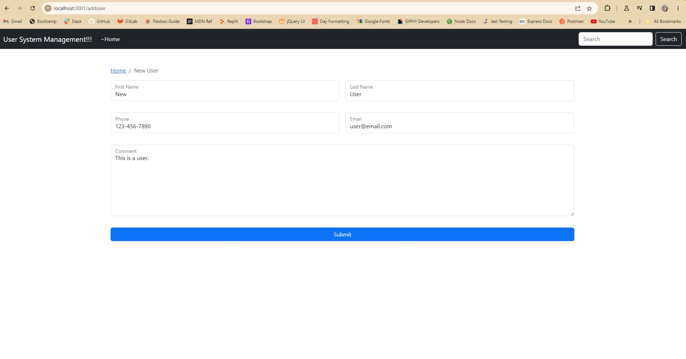

# User Managment

## Description

I wanted to relearn and test my abilities in Handlebars template engine as well as mysql and express. It allows users to make a list of people with attached data. It is also possible to access and view indivisual people and see their comments. It's a CRUD application. I learned a lot about SQL because I am more use to using an ORM to manipulate the database. I also got practice in Handlebars.

## Installation

You will need to put the appropriate database information in the .env. It is also necessairy to install mysql2, dotenv, express, express-handlebars. Nodemon was used in the development.

## Usage

Click the add user button to go to a form that will allow you to add a new user. click on view next to a user to see their indivisual data. Click edit to access a form that will allow their data to be changed. Finally, click on delete to remove a user.

 

## Credits

I coded alongside the youtube user Raddy's video, User Management SYstem - Nodejs, Express, MySQL & Express-Handlebars.

The video can be found [here](https://www.youtube.com/watch?v=1aXZQcG2Y6I).